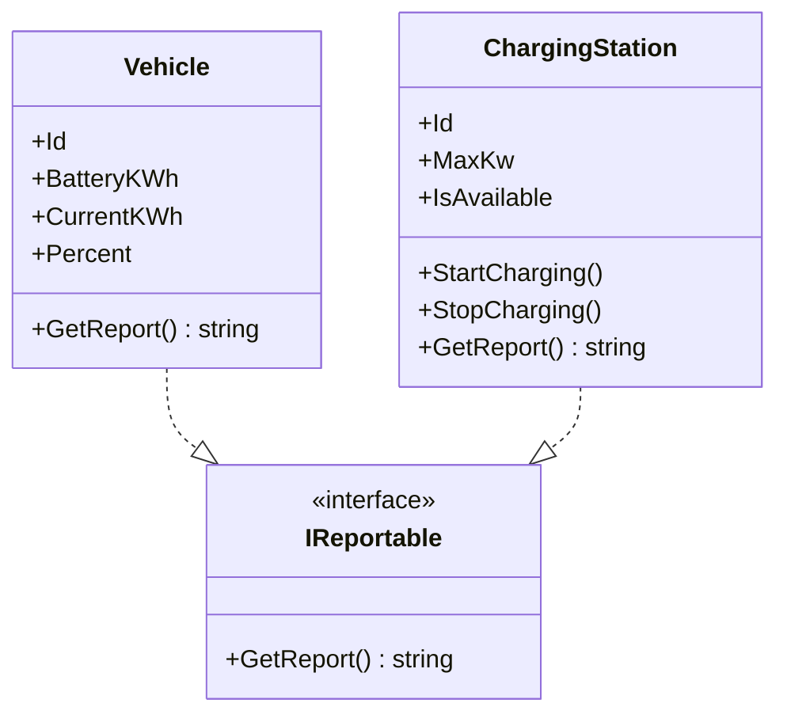

# ChargeHub

## Klassdiagram

```mermaid
classDiagram
    class IReportable {
        <<interface>>
        +GetReport() string
    }

    class Vehicle {
        +Id
        +BatteryKWh
        +CurrentKWh
        +Percent
        +GetReport() string
    }

    class ChargingStation {
        +Id
        +MaxKw
        +IsAvailable
        +StartCharging()
        +StopCharging()
        +GetReport() string
    }

    Vehicle ..|> IReportable
    ChargingStation ..|> IReportable
```

## Programutskrift

Bil 1: 0 %

Station AC-01: 11 kW

Station DC-01: 150 kW